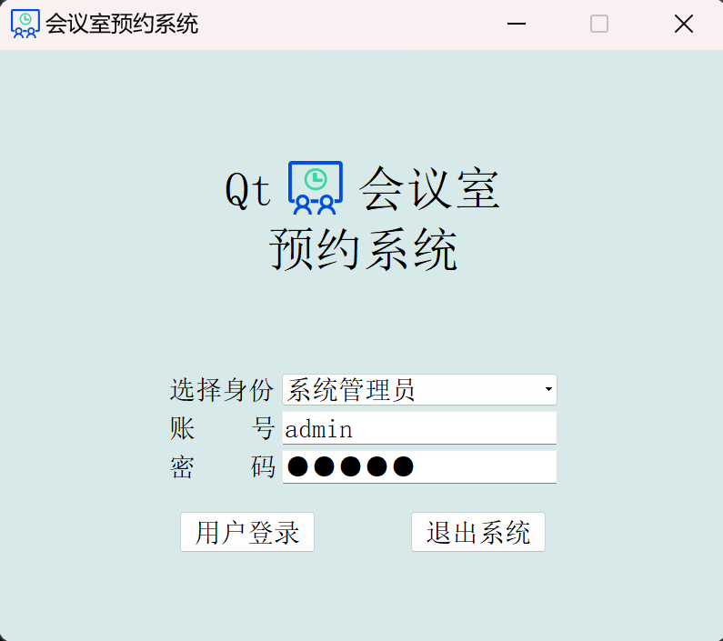
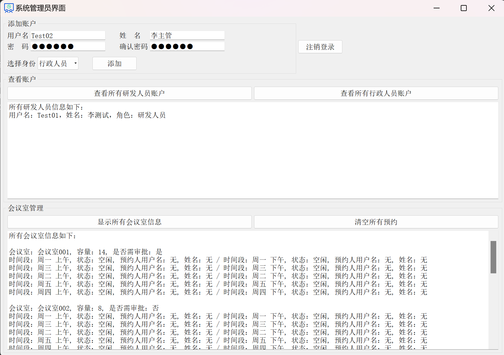
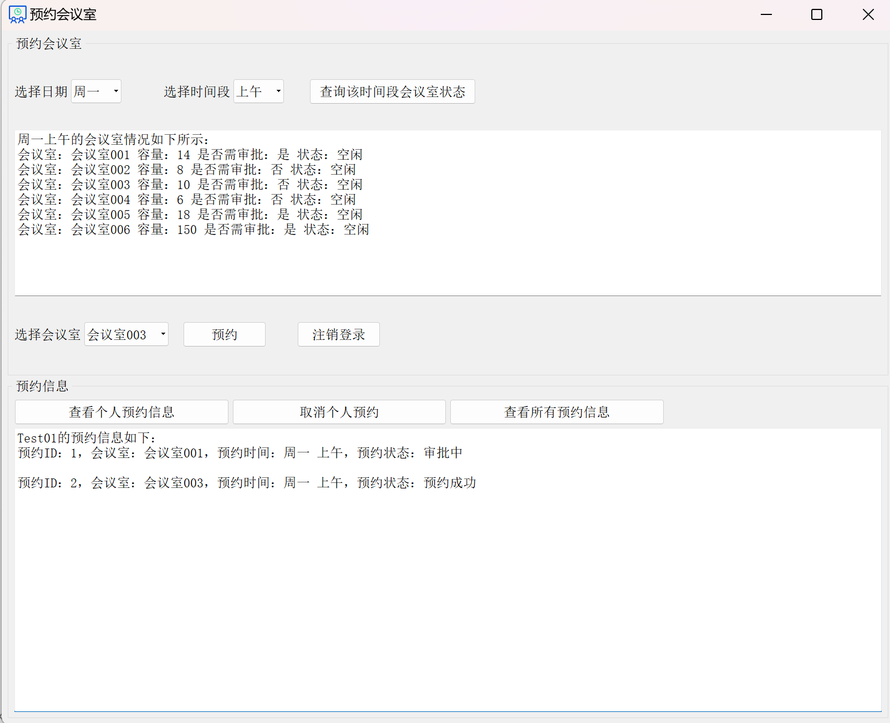
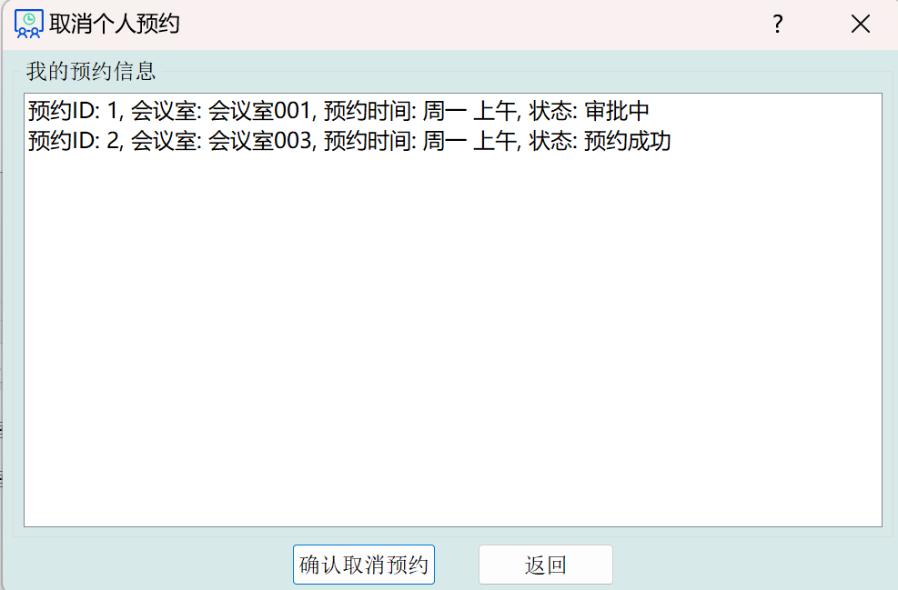
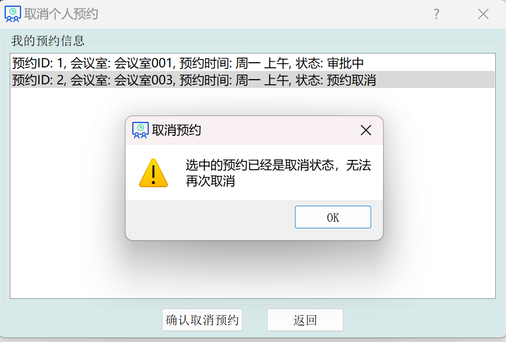
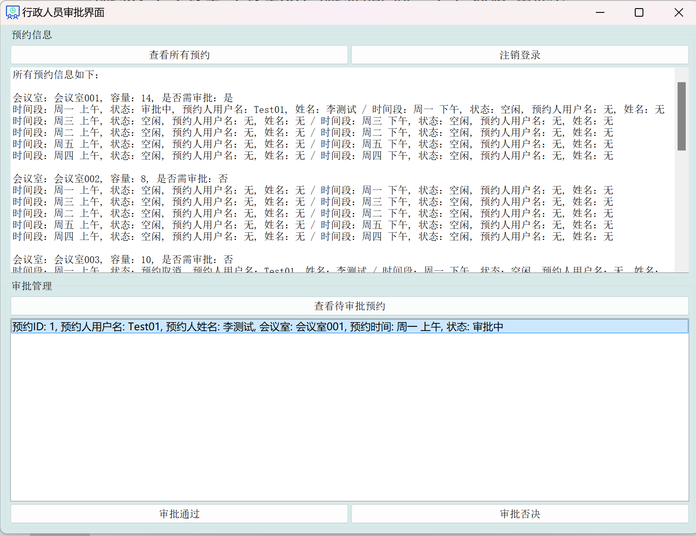

# 会议室预约系统

## 系统概述

### 开发环境

C++ 11

VS2019

Qt 5.9.3

SQLite 3

### 单元测试

使用了`QTest`进行了单元测试，使用`OpenCppCoverage`进行了测试覆盖率的检测，由于界面中使用了大量的逻辑判断，并且使用了大量的UI代码，不太易于测试，测试覆盖率为84%。

### 用到的技术

1. 将人员信息、会议室信息、预约信息都保存在了`SQLite`数据库中，**通过设置外键和关联查询的方式来进行各种操作**；

2. 为了保护密码安全，在存储密码时使用了`sha256`加密算法 **对用户密码进行了加密**，在登录时只需要对用户输入的密码同样进行`sha256`加密，再与数据库中保存的密码进行比对即可；

3. 与数据库相关的所有操作都封装在了`KDataBase`类中，并采用C++11的新特性 **magic static** 将其设置为了 **单例模式**，这样可以保证在程序的一个进程运行时，**全局只保留一个数据库的连接**，只有在主程序完全退出时，才会关闭数据库的连接。这样就可以增加安全性，并且减少频繁创建和关闭数据库连接所带来的性能开销。另外，还采用了 **依赖注入** 的方式提高了程序的可测性；
4. 为了提高程序的并发性，设置了`SQLite`数据库为 **WAL** 模式，这样就可以使得 **读操作和写操作同时进行**，并且写入的数据会直接写入到WAL文件中，这 **避免了在主数据库文件上的多次写入操作**，提高了数据库写操作的效率；
5. 为了提高并发性，在进行数据库的 **写操作** 时，使用了`IMMEDIATE` 事务，一方面可以保证在写入数据的时候其他读操作可以同时进行；另一方面由于更早的确保了写访问权限，**减少了死锁发生的可能性**；
6. 将数据库的查询操作都封装在了`KDatabaseWorker`类中，**同时使用了`QThread`多线程技术**，同时利用 **信号和槽** 技术进行数据库的异步查询，从而避免由于数据库的查询操作而阻塞主进程，阻塞主进程会导致用户的界面操作响应迟钝，甚至卡死。

最后，为了提高程序的健壮性做了很多代码优化，如下所示。

## 程序健壮性

### 登录界面

登录的时候会按照顺序进行以下三种检测：

1、检测用户是否存在

2、检测用户身份权限是否正确

3、检测登录密码是否正确

### 注册界面

注册界面会做下面四种检测

1、添加的用户名是否已经存在

2、输入的姓名是否为空

3、输入的密码是否为空

4、两次输入的密码是否一致

### 会议室预约界面

在研发人员进行会议室预约时，会进行下面几种检测

1、预约的会议室是否空闲，空闲才能预约

2、取消个人预约时，已经取消的预约不能被再次取消

### 其他健壮性

1、在预约会议室时，会进行会议室是否需要审批的检测，需要审批的会议室经过审批后才能预约成功，审批被驳回则预约失败；

2、程序刚开始运行，要进行一系列的检测：数据库是否存在，不存在则创建；数据表是否存在，不存在则创建；会议室信息是否已经被初始化，没有则初始化会议室信息；是否创建了默认管理员“admin”，没有则创建。

## 界面展示

### 首页

### 系统管理员操作界面

### 研发人员操作界面

### 取消预约对话框

取消成功

### 行政人员操作界面

